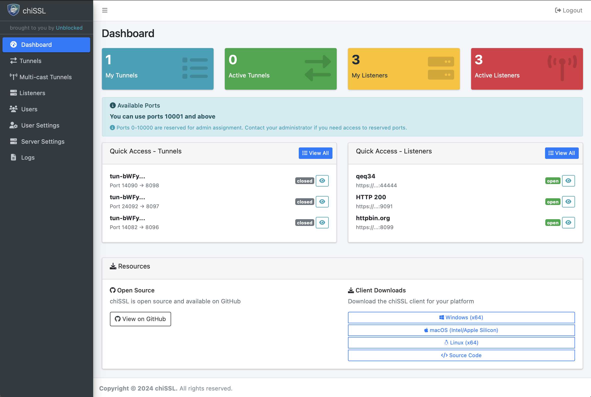

# chiSSL

Modern HTTPS reverse tunnels with live traffic capture and a simple dashboard.



## Highlights
- On-demand HTTPS reverse tunnels
- Live request/response capture with searchable history
- Mock and proxy listeners for development and testing
- Multicast tunnels (fan-out to multiple targets)
- Role-based access (admin and user), API tokens, optional SSO
- SQLite by default; PostgreSQL supported
- REST API and web dashboard

## Quick start

Server (automatic TLS via domain):

```bash
./chissl server -v \
  --tls-domain tunnel.mydomain.com \
  --auth admin:REPLACE_THIS_WITH_A_PASSWORD \
  --dashboard
```

Notes:
- Ensure the domain points to this server’s public IP
- The dashboard will be available at https://tunnel.mydomain.com/dashboard
- You can alternatively supply your own certs using --tls-key/--tls-cert

### Client
Single mapping:
```bash
chissl client --auth user:pass https://tunnel.mydomain.com \
  "8080->80"
```
Multiple mappings:
```bash
chissl client --auth user:pass https://tunnel.mydomain.com \
  "8080->80" "8443->443:myapp.local" "9000:0.0.0.0->9000"
```

### Client profile (YAML)
Place a yaml file at $HOME/.chissl/profile.yaml (or pass --profile). Example:
```yaml
server: "https://tunnel.mydomain.com"
auth: "user:pass"
remotes:
  - "8080->80"
  - "8443->443:myapp.local"
keepalive: 30s
verbose: true
```
This lets you manage tunnel settings locally without repeating flags.

## Documentation
- Docs site: https://unblocked.github.io/chissl/

## Install
- Download binaries from Releases: https://github.com/unblocked/chissl/releases
- Or build from source (Go 1.21+, CGO enabled):
```bash
go build ./...
```

## Features (overview)
- Dashboard: manage tunnels, listeners, and view live captures
- Listeners: mock endpoints or proxy to upstreams; optional TLS termination
- Multicast: fan-out to multiple destinations with centralized control
- Security: admin/user roles, API tokens, rate limits and login backoff
- Database: SQLite by default; PostgreSQL for persistence and scale

## Support
Please open issues and feature requests here: https://github.com/unblocked/chissl/issues

---

Copyright © NextChapter Software
