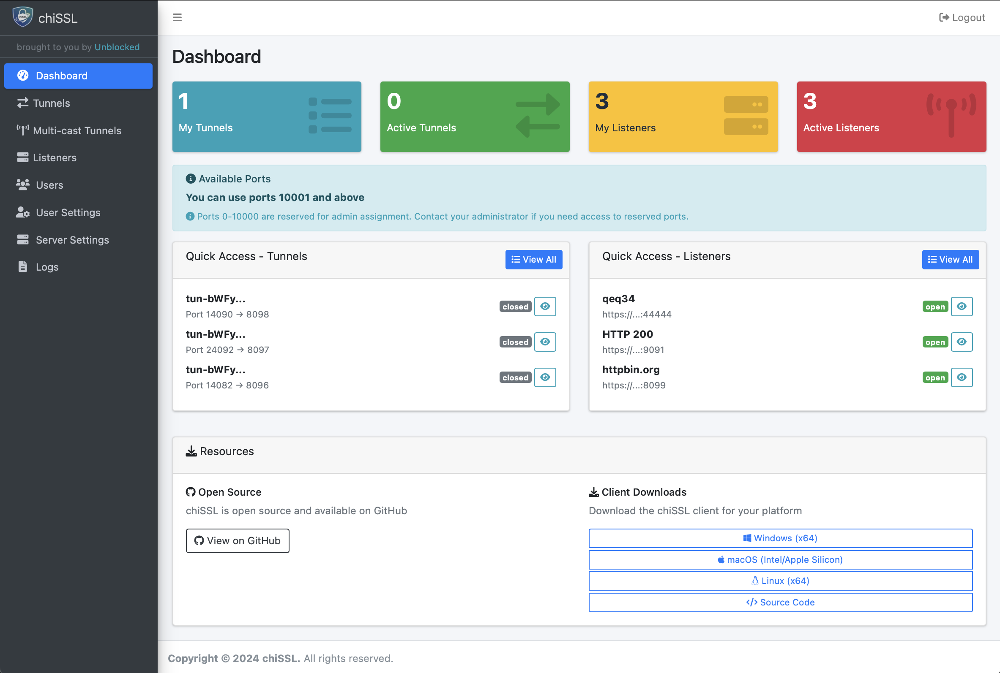

# chiSSL Overview

A quick visual tour of chiSSL: on-demand HTTPS reverse tunnels, live capture, multicast tunnels, and mock/proxy listeners.

---

## HTTPS on-demand tunnels & live capture
Create secure tunnels on demand. Capture traffic and view live request/response details directly in the dashboard.

- Tunnels list and quick status
- Live capture details with headers and formatted bodies
- Search and filters to locate exchanges

Images:

---

## Multicast tunnels
Fan out traffic from one source to multiple destinations with centralized control and visibility.

---

## Mock & Proxy listeners
Spin up mock endpoints or forward to real upstreams with optional rewrites. Enable TLS termination and capture for debugging.

---

## Users & access control
Role-based access control with admin and user roles. Support for basic auth and SSO.

---

## Security settings
Login backoff, IP rate limiting, and system security settings help protect your endpoints.

---

## API Reference
- API Reference (Redoc): [API](./api.md)
- OpenAPI YAML: [openapi-public.yaml](./openapi-public.yaml)

